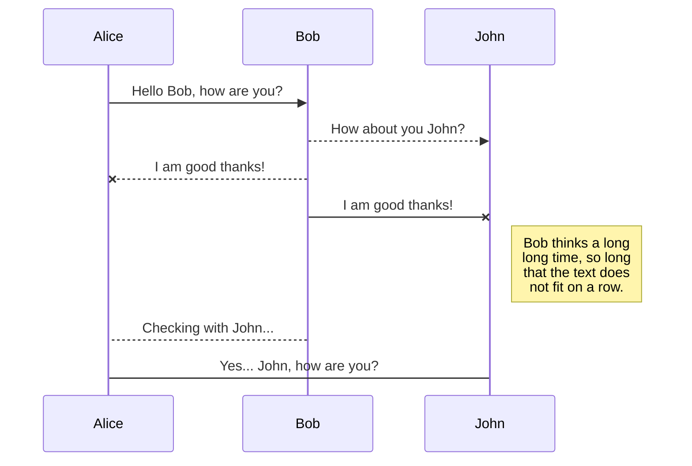
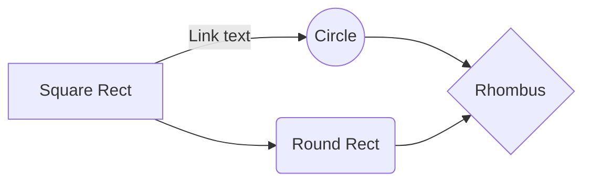

# Welcome to Markdown SheetCheat!


# This is an Heading 1
## This is an heading 2
### This is an heading 3
#### This is an heading 4
##### This is an heading 5
###### This is an heading 6

## Bold text
If you want to bold text just to lay emphasis in **Markdown**, You add two asterisk. 

## Adding a blockquote
To add a blockquote, just add the greater than symbol ( > ) before the text or pararaph.

 > It is very easy to add a blockquote.

You can also nest blockquotes by addind >> in front of the text or paragraph.

> The first blockquote.
>
>> And now the nested text/paragraph.


## Ordered list
Add an ordered list to a list of texts, you should manually add the numbers yourself e.g 1,2,3,4,5 ...

1. This is the top
2. This is the middle
3. This is the bottom.

## Unordered list
Add an unordered list to a list of texts, you can achieve that using dash ( - ).

- This is the top
- This is the middle
- This is the bottom.

## Adding links
You can easily embed links into your text by following this syntax. 

[Google website](https://www.google.com/)

## Adding an image
I know you want you add some visuals and images to your markdown to make it more interactive and fun, here is how to add an image in markdown.


## Adding a table
You can easily add tables to your markdown file, by using the pipe symbol ( || ).


|         |Advantage                  |Disadvantage                       |
|---------|---------------------------|-----------------------------------|
|1.       |It is cheap                |It is quite expensive              |
|2.       |It is readily available    |It is not readily available        |
|3.       |Its is easy to use         |Its is quite complex to understand |

## Adding a code block
You can easily add your favorite code into your markdown file using three backticks followed by the programming language.

```python
print("Hello world")
```

```javascript
console.log("Hello world");
```

## Adding Italc to text
To italicize text, add one asterisk before and after a word or phrase.

The dog *barks* loudly.

## Add bold and italic to a text
To emphasize text with bold and italics at the same time, add three asterisks before and after a word or phrase.

This examination is ***really important***.

## Adding horizontal rules
To create a horizontal rule, use three or more asterisks (***), dashes (---) on a line by themselves.

***

or

---

## Adding URLs and Email Addresses
To quickly turn a URL or email address into a link, enclose it in angle brackets.

<https://www.google.com>
<johndoe@example.com>

## Adding Emoji
That video is very funny! :joy:

## Subscript	
H~2~O

## Superscript	
Add the carret symbol in between the two letters or numbers
X^2^




And this will produce a flow chart:


