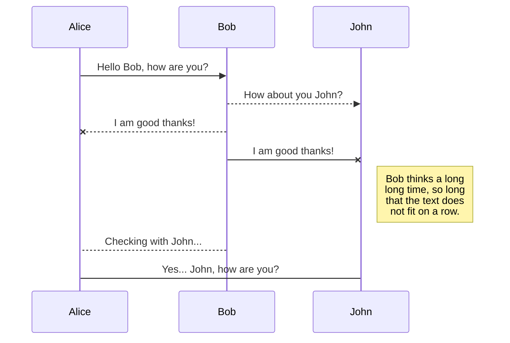
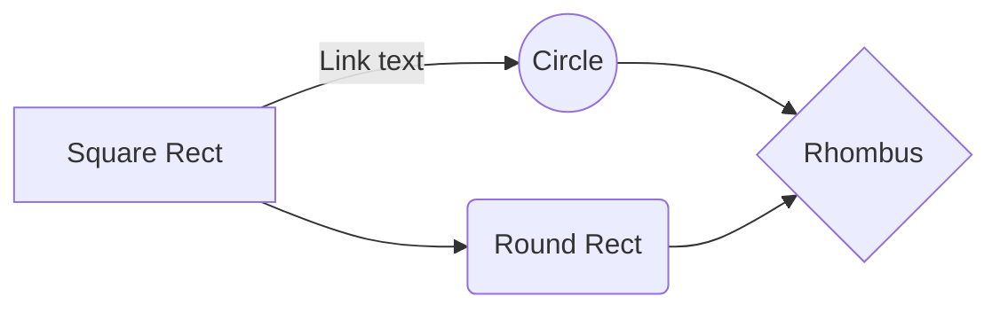

# Welcome to Markdown SheetCheat!

# This is an Heading 1
## This is an heading 2
### This is an heading 3
#### This is an heading 4
##### This is an heading 5
###### This is an heading 6

## Bold text
If you want to bold text in **Markdown**, You add two asterisk. 

## Adding a blockquote
To add a blockquote, just add the greater than symbol ( > )

 > It is very easy to add a blockquote.

## Ordered list
Add an ordered list to a list of texts, you should manually add the numbers yourself e.g 1,2,3,4,5 ...

1. This is the top
2. This is the middle
3. This is the bottom.

## Unordered list
Add an unordered list to a list of texts, you can achieve that using dash ( - ).

- This is the top
- This is the middle
- This is the bottom.

## Adding links
[Handlebars templates](http://handlebarsjs.com/)

## Adding an image

## Adding a table
|                |ASCII                          |HTML                         |
|----------------|-------------------------------|-----------------------------|
|Single backticks|`'Isn't this fun?'`            |'Isn't this fun?'            |
|Quotes          |`"Isn't this fun?"`            |"Isn't this fun?"            |
|Dashes          |`-- is en-dash, --- is em-dash`|-- is en-dash, --- is em-dash|

## Adding a code block

## 

## Publication

You can render LaTeX mathematical expressions using [KaTeX](https://khan.github.io/KaTeX/):

The *Gamma function* satisfying $\Gamma(n) = (n-1)!\quad\forall n\in\mathbb N$ is via the Euler integral

$$
\Gamma(z) = \int_0^\infty t^{z-1}e^{-t}dt\,.
$$

> You can find more information about **LaTeX** mathematical expressions [here](http://meta.math.stackexchange.com/questions/5020/mathjax-basic-tutorial-and-quick-reference).

## UML diagrams

You can render UML diagrams using [Mermaid](https://mermaidjs.github.io/). For example, this will produce a sequence diagram:

And this will produce a flow chart:

